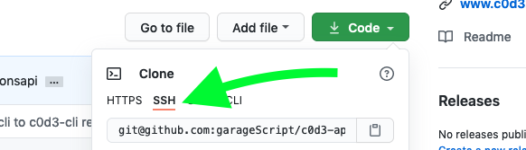

# Learn Databases

A free site to learn and try different databases.

**Installation**

1. Fork the repository.

    

2. Download the fork into your local machine. 

    Get the SSH url, go to a folder on your local machine and paste the copied command. 
    

    Example:

    `git clone git@github.com:your-username/databases.git`

    If you get the following error:

    `git@github.com: Permission denied (publickey).                                     
    fatal: Could not read from remote repository. `

    You need to [generate SSH key and add it to your github account](https://docs.github.com/en/github/authenticating-to-github/generating-a-new-ssh-key-and-adding-it-to-the-ssh-agent). With SSH keys, you can connect to GitHub without supplying your username or password at each visit
    
    Alternatively, you can use the HTTPS url, this way you don't need SSH keys. 

3. Once the fork was downloaded you need to install required node modules with `npm i`

4. To run server you need to get valid credentials. There is no automatic way to generate them yet, so ask folks in our [chat](https://chat.c0d3.com/c0d3/channels/) or pm serniebanders.

5. Create .env file with provided credentials.

Now you can start server locally `npm run start:dev`

If you need to make changes to the database run:  
`ALTER_DB=true npm run start:dev`

### Production Phases

Phase 1: Modules (helper function)

Phase 2: Functions that power user interactions

Phase 3: API to power user interactions (backend)

Phase 4: UI (aka frontend)
**We are here!**

* [Issues](https://github.com/garageScript/databases/issues)

* [Wiki](https://github.com/garageScript/databases/wiki)

* If you have any questions message us on our [chat](https://chat.c0d3.com/c0d3/channels/)

__Sequelize credentials are in the chat for privacy__
