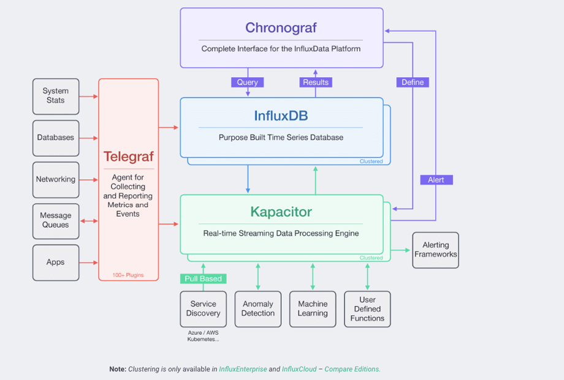

# Timeseries overview

Timeseries databases are optimized for storing and serving pairs of times and values. This could be various metrics, events, sensor data, stock currency exchange price data and other types of analytics.  

**Key-concepts**

* More writes than reads: 95%-99% of the operations on time series data are writes.
 
* Smooth, continuous, highly concurrent, and high throughput data writing. Time series data is usually generated at a fixed time frequency.

* Data is written and is not updated. In the time dimension, as time passes by, all data written is new. No existing data is updated, except for manual revision.

# InfluxDB

InfluxDB is an open source time series platform. It uses following format `measurement-name tag-set field-set timestamp`. For example:
```
cpu, host=serverA, region=uswest idle=23, user=42, system=12 1464623548s
``` 
Measurement-name `cpu` is a string, the tag set `host=serverA, region=uswest` is a collection of key/value pairs where all values are strings and the field-set `idle=23, user=42, system=12` is a key/values pairs where values can be int64, float64, bool or string. Timestamps `1464623548s` in InfluxDB can be second, millisecond, microsecond, or nanosecond precision. 

Conceptually you can think of a measurement as an SQL table, where the primary index is always time. Tags and fields are effectively columns in the table. tags are indexed, and fields are not. The difference is that, with InfluxDB, you can have millions of measurements, you don’t have to define schemas up-front, and null values aren’t stored. 

Note that if you attempt to write data with a different type than previously used, InfluxDB will reject those data.
So trying to add something like this (idle field was changed to string) to cpu measurement will result in error. 
```
cpu, host=serverA, region=uswest idle=someString, user=42, system=12 1464623210s
``` 
InfluxDB stores data on the disk in columnar format which make calculating aggregates on a single field a very fast operation. On the other hand, map-reduce queries are slower compared to relational databases but such queries are rare in timeseries databases, so it's a worthwile tradeoff. The measurement name and tag sets are kept in an inverted index for fast lookups. You can read more about design decisions and tradeoffs [here](https://docs.influxdata.com/influxdb/v1.8/concepts/insights_tradeoffs/). 

# Node-influx

InfluxDB has several open endpoints like `/query`, `/write`, by sending HTTP requests to these points you can read/write data. While working with node server it's more convinient to use [influx](https://www.npmjs.com/package/influx) npm package. First you need to configure influx client:
```
const client = new Influx.InfluxDB({
 host: 'hostname',
 database: 'database_name',
 username:'your_username'
})
```
You can ping your server to check if everything is OK:
```
client.ping(5000).then((hosts) => {
  hosts.forEach((host) => {
    console.log(
      `${host.url.host} responded in ${host.rtt}ms running ${host.version})`
    );
  });
});
```
It should return something like `hostname:port responded in 27ms running 1.8.3`. 

Now you're ready to write data to your database. 

```
client.writePoints([
  {
    measurement: 'cpu',
    tags: { host: 'serverA',region:'USWest' },
    fields: { idle:23, user:12, server:11 },
  }
],{
    database:"database_name"
})
```
`writePoints` takes array of points as first argument and optional config object and returns a promise [(reference)](https://node-influx.github.io/class/src/index.js~InfluxDB.html#instance-method-writePoints).

And read data:
```
client.query("select * from cpu", { database: "username" }).then((results) => {
  console.log(results);
});
```
`query` takes query string and optional config object and returns a promise [(reference)](https://node-influx.github.io/class/src/index.js~InfluxDB.html#instance-method-query). InfluxDB uses its own SQL-like language, you can learn more about writing queries with InfluxQL [here](https://docs.influxdata.com/influxdb/v1.8/query_language/explore-data/).


# Continious queries and retention policies

InfluxDB can handle millions of data points per second. Working with that much data over a long period can lead to storage concerns. InfluxDB automatically compacts data to minimize your storage space. In addition, you can easily downsample the data; keeping high-precision raw data for a limited time and storing the lower-precision, summarized data for much longer or until the end of time. InfluxDB has two features that help to automate the downsampling and data expiration processes — Continuous Queries and Retention Policies.

**Retention policy** (RP) is the part of InfluxDB data structure that describes for how long InfluxDB keeps data. InfluxDB compares your local server’s timestamp to the timestamps on your data and deletes data older than the RP’s DURATION. A single database can have several RPs and RPs are unique per database. For example, the following command will create new retention policy `two_hours` for your database, which keeps data for duration of 2h and is default for this database. The replication factor is a required parameter but must always be set to 1 for single node instances.
```
client.createRetentionPolicy("two_hours",{
  duration:"2h",
  replication:1,
  database:"database_name",
  isDefault:true
})
```
Next we create another retention policy which keeps the data for 52 weeks. 
```
client.createRetentionPolicy("a_year",{
  duration:"52w",
  replication:1,
  database:"database_name",
  isDefault:false
})
```
Note that any operations that don't explicitly specify RP will still go to the default `two_hours` retention policy.

**Continuous query** (CQ) is an query that runs automatically and periodically within a database. CQs require a function in the SELECT clause and must include a GROUP BY time() clause.
```
client.createContinuousQuery("cpu_30",`SELECT mean("cpu") AS "mean_cpu"
INTO "a_year"."downsampled_measurements"
FROM "cpu"
GROUP BY time(30m)`,"database_name")
```
This query creates a CQ called `cpu_30`. It tells InfluxDB to calculate the 30-minute average in the DEFAULT RP `two_hours`. It also tells InfluxDB to write it to the measurement `downsampled_measurements` in the retention policy `a_year` with the field keys `mean_cpu`. InfluxDB will run this query every 30 minutes for the previous 30 minutes.

With such setup we can have detailed data of the last two hours while keeping 30m averages for a year. 

# The TICK stack

InfluxDB is a part of so called TICK stack, which constists of Telegraf, InfluxDB, Chronograf and Kapacitor. The TICK Stack is a set of open source projects designed to handle massive amounts of time-stamped information to support analysis data.



[Telegraf](https://www.influxdata.com/time-series-platform/telegraf/): A metrics collection agent. Use it to collect and send metrics to InfluxDB. Telegraf’s plugin architecture supports collection of metrics from 100+ popular services right out of the box.

[Chronograf](https://www.influxdata.com/time-series-platform/chronograf/): A UI layer for the whole TICK stack. Use it to set up graphs and dashboards of data in InfluxDB and hook up Kapacitor alerts.

[Kapacitor](https://www.influxdata.com/time-series-platform/kapacitor/): A metrics and events processing and alerting engine. Use it to crunch time series data into actionable alerts and easily send those alerts to many popular products like PagerDuty and Slack.
